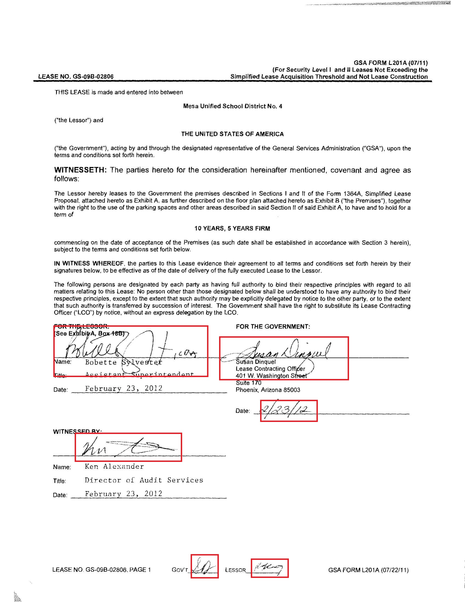

## Handwritten Text Detection in Document Imgages 
We wish to detect the handwritten text in the scanned/pdf document. It could be for number of reasons like

  * to identify if the document has been signed
  * to process handwritten text in the document in a different way
  * to mask the handwritten text
  
Take following document image for an example. We wish to detect the text highlighted in the red bounding boxes.


### Detectron2 Framework
We will use pytorch detectron2 framework because it is simple and easy to extend. There are simple Training, Visualization, and Prediction modules available in the detectron2 which handles most of the stuff and we can use it as is, or if required, we can extend the functionality.

Simple steps to train a vision model in Detectron2
  
  1. Convert dataset in the [detectron2 format](https://detectron2.readthedocs.io/tutorials/datasets.html#standard-dataset-dicts)
  2. [Register the dataset](https://detectron2.readthedocs.io/tutorials/datasets.html#register-a-dataset) and metadata information like class labels
  3. Update the config with registered dataset (DATASETS.{TRAIN,TEST}), model weight (MODEL.WEIGHT), learning rate, Number of output classes (MODEL.ROI_HEADS.NUM_CLASSES), and other training and test parameters
  4. Train the model using [DefaultTrainer](https://github.com/facebookresearch/detectron2/blob/master/detectron2/engine/defaults.py) class
  
 
#### Dataset Preparation(step 1 & 2)
Detectron2 expects the dataset as list[dict] in the following format. So for training with detectron2 we will have to convert our dataset in the following format.

```python
[{'file_name': 'datasets/JPEGImages/1.jpg',
  'image_id': '1',
  'height': 3300,
  'width': 2550,
  'annotations': [{'category_id': 1,
    'bbox': [1050.1000264270613,
     457.33333333333337,
     1406.9139799154334,
     587.7450980392157],
    'bbox_mode': <BoxMode.XYXY_ABS: 0>},
   {'category_id': 1,
    'bbox': [1529.9097515856238,
     473.5098039215687,
     1617.167679704017,
     555.3921568627452],
    'bbox_mode': <BoxMode.XYXY_ABS: 0>}]}]
```

Detectron registers this list of dict as torch dataset and uses the default dataloader and datasampler for training. We can register the list[dict] with detectron2 using following code

``` python
def get_dicts():
  ...
  return list[dict] in the above format

from detectron2.data import DatasetCatalog
DatasetCatalog.register("my_dataset", get_dicts)
```

And to register the metadata information related to dataset like category mapping to id's, the type of dataset, we have to set the keyvalue pair using

```python
MetadataCatalog.get("my_dataset").thing_classes = ["person", "dog"]
```

#### Choosing a Model and Initializing Configuration (step 3)

Detectron2 has lot of pretrained model available in the [model zoo](https://github.com/facebookresearch/detectron2/blob/master/MODEL_ZOO.md). For handwritten text detection, we will choose Faster RCNN with FPN backbone. 

We have to initialize the parameters and weights for model we want to train. 

``` python
cfg = get_cfg()
cfg.merge_from_file('<pretrained model config'>)
cfg.MODEL.WEIGHTS = '<path to pretrained model weight>

#custom config for training
cfg.DATASETS.TRAIN = ("<registered training dataset name>",)
cfg.SOLVER.MAX_ITER = '<number of training iterations>'
cfg.MODEL.ROI_HEADS.NUM_CLASSES = '<number of classes>'
```

All the model configs are available in cfg object. If we want to replicate the training later, we can save the cfg object and load it back to resume training.

#### Model Training (step 4)
We will use the DefaultTrainer for now. There are simple modules available which only accept the minimal parameters and make assumptions about lot of things.  

The DefaultTrainer Module 
  * builds the model
  * builds the optimizer
  * builds the dataloader
  * loads the model weights, and
  * register common hooks
  
```python
trainer = DefaultTrainer(cfg) 
trainer.resume_or_load(resume=False)
trainer.train()
```
